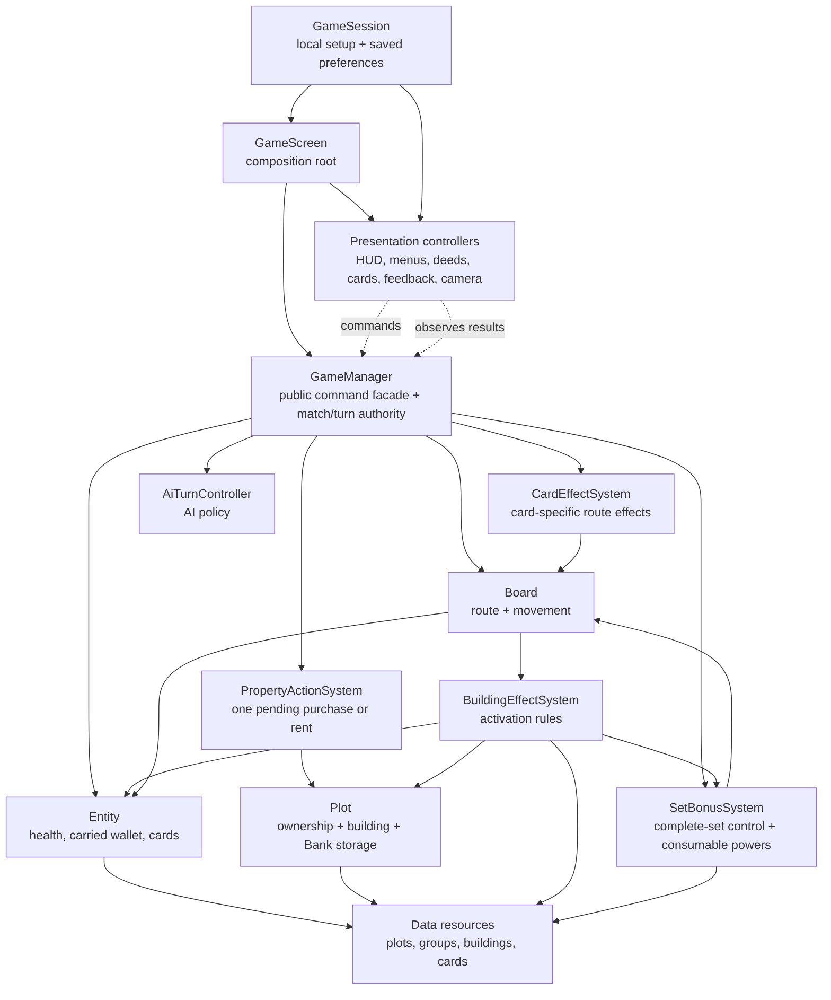

# Fortune Under Fire Architecture

This is the living technical map for Fortune Under Fire. It describes the
architecture that exists in the repository today, not an idealized future
version. Use it to decide where a change belongs before adding code.

Last reviewed: 2026-08-15

## Updating this document

Update this file in the same change whenever any of these change:

- a system becomes the source of truth for new state;
- a dependency is added between systems;
- a public command, result object, or signal contract changes;
- a resource schema or stable content ID changes;
- a save, replay, determinism, or networking boundary changes;
- a responsibility moves between gameplay and presentation.

Do not put balance values or a complete content catalogue here. Those belong in
resources and design documentation. This file records ownership and contracts.

## Runtime map

`play_scenes/test_scene.tscn` is the playable composition. `GameScreen` wires
the systems, configures participants, starts the match, and routes global input.
It does not implement property, building, camera, or HUD rules.



Solid arrows are gameplay dependencies. Dotted arrows are presentation command
submission and observation. Presentation may ask the facade to perform an
action; it must never settle money, apply damage, assign ownership, or advance a
turn itself.

## Authority and local presentation

Authoritative state is state that must eventually be saved, replayed, or
replicated by a server:

- participant order, round, turn, active participant, and match state;
- whether the active participant has rolled, remaining roll allowances, and
  whether movement is resolving, a revealed authoritative roll, and a pending
  Guided Current movement choice, plus each participant's last successful
  Hospital Run round;
- entity health, carried money, defeat reason, and cards;
- entity route indices;
- plot ownership, constructed building, and per-Bank stored balance;
- derived complete-set control plus per-turn uses and per-lap power charges;
- the single pending `LandingAction`;
- resolved dice, card draws/plays, Casino rolls, transactions, damage, and
  healing.

Local presentation state is never match authority:

- camera target, interpolation, zoom, and event holds;
- the currently presented human seat;
- selected or hovered property deed;
- whether a panel is visible or a deed is extended;
- text, health-bar meshes, ownership markers, materials, tweens, and flashes;
- compact floating feedback labels.
- menu/setup state and saved local preferences in `GameSession`, including
  camera behavior and whether developer shortcuts are enabled.

The local presentation layer reacts after a gameplay result. It can disappear
or be replaced without changing the simulated outcome.

## System ownership

| System | Source of truth / responsibility | Public surface | Must not own |
| --- | --- | --- | --- |
| `GameSession` | Menu selections plus local camera/developer preferences persisted in `user://settings.cfg` | typed setting setters, `load_settings()`, `save_settings()` | Match rules, entity state, or gameplay outcomes |
| `GameScreen` | Scene assembly, participant setup, active local-seat rebinding, global Space/Escape routing | `get_selected_property()` compatibility delegate | Gameplay rules, UI implementation details |
| `GameManager` | Match lifecycle, active turn, command validation, stable gameplay facade | `start_match()`, `request_*()`, `play_active_turn()`, lifecycle/result signals | Camera movement, HUD state, building effect formulas, AI decision policy |
| `PropertyActionSystem` | Exactly one pending purchase or rent and its settlement path | `resolve_purchase()`, `pay_rent()`, pending-action queries, property result signals | Turn order, UI, building attacks |
| `LandingAction` | Typed pending property interaction | kind, actor, plot, counterparty, quoted amount | Presentation strings or buttons |
| `AiTurnController` | Delay and choices for an AI turn using normal public commands | `schedule_turn()` | Special transaction/movement shortcuts, authoritative state |
| `CardEffectSystem` | Card-specific route facts and forced movement | hospital lookup and forward hospital movement | Card consumption, turn advancement, card UI |
| `CardPlayResult` | Typed resolved card outcome | actor, card, outcome, destination index | Presentation animation or turn validation |
| `SetBonusSystem` | Derives five-plot control and owns per-turn/per-lap power uses | control/progress queries, construction quote, movement/damage/Tribute modifiers, control/charge/result signals | UI, auctions, building modules, route movement |
| `Board` | Ordered route, entity indices, movement tween lifecycle, route distance | `move_entity()`, `move_entity_by_spaces()`, `register_entity()`, route queries and movement signals | Building/card formulas, camera policy, turn advancement |
| `BuildingEffectSystem` | Lap and landing activation rules for all base buildings | `activate_lap()`, `activate_landing()`, typed activation signal | Building meshes, HUD feedback, match advancement |
| `BuildingActivation` | Typed resolved building outcome | effect kind, source, target, amount, die roll | Animation or localized copy |
| `Plot` | Property aggregate: economic values, owner, building, Bank storage, transactions, landing dispatch | purchase/rent/construction/Bank commands and state-change signals | Mesh construction, marker styling, building activation rules |
| `PlotPresenter` | Plot top material, owner marker, building mesh, activation pulse | refresh and play-animation methods | Ownership or rent state |
| `Entity` | Health, carried wallet, defeat reason, hand, identity, starting stats | damage/heal/voluntary-spend/mandatory-obligation/card commands and state signals | Health-bar implementation, floating-label implementation |
| `EntityPresenter` | Entity material, world health bar, feedback labels and flashes | refresh and feedback methods | Applying money, damage, healing, or defeat |
| `GameCamera` | Camera target and local smoothing/orbit behavior | `focus_turn_target()`, `track_target()`, `hold_event_target()` | Choosing the active turn or resolving outcomes |
| `TurnCameraController` | Turns `turn_started` into local camera policy | manager signal subscription | Match authority |
| `LocalSeatController` | Identification of the active human seat for immediate local presentation rebinding | `presented_player_changed` | Participant type, turn advancement, or gameplay data |
| `TurnHudController` | Roll/End Turn button and turn/roll text | `perform_turn_action()`, `refresh()` | Turn validation |
| `WorldActionController` | Plot-anchored Buy/Decline/Pay Rent presentation | manager command submission, `refresh()` | Property transactions |
| `OwnedPropertyRailController` | Deed list, hover/selection state, deed camera previews | selection signal, selection/preview methods | Property ownership |
| `BuildingPaletteController` | Contextual plot manager: construction on empty deeds and building details/actions once built | construction and Bank command submission, `refresh()` | Construction/Bank authority or building effects |
| `CardHandController` | Active local seat's collapsed/revealed hand, responsive card spacing, invisible release-target geometry, release-time validation, and card command submission | `set_local_player()`, `refresh()`, self/property release targets, manager command submission | Card-face animation, consumption, or effect resolution |
| `CardView` | One portrait card face and its local hover, drag, return, cast, and fly-off animation | `configure()`, `set_interactive()`, drag lifecycle signals | Gameplay legality, target validation, consumption, or effects |
| `SetBonusHudController` | Compact local controlled-set summary and Guided Current choice | manager signal subscription and adjustment command submission | Set ownership or power consumption |
| `LocalPlayerHudController` | Presented human seat's health/funds display and inline balance delta | `configure()`, `set_player()` | Entity stats |
| `GameplayFeedbackController` | Visual choreography for rent, lap, damage, and healing results | result signal subscriptions | Mutating any gameplay state |
| `DeveloperToolsController` | Gated local developer input and compact confirmation | `try_handle_input()`, `grant_random_card()` | Bypassing GameManager validation or changing match state directly |

## Dependency rules

1. Presentation can depend on the `GameManager` facade and read domain state.
   Gameplay code cannot depend on presentation controllers.
2. `GameManager` validates a command before delegating its specialized work.
   UI code never calls `Plot.purchase()`, `Plot.pay_rent()`, or health/money
   mutations to simulate a player action.
3. `Board` supplies route facts. Building rules may query route distance but do
   not modify Board's movement bookkeeping.
4. Domain objects publish state changes. Presenters render those objects and do
   not become an alternative source of truth.
5. New cross-system outcomes use typed result objects. Positional signals remain
   only as temporary compatibility bridges.
6. Resource IDs (`building_id`, `card_id`, `group_id`, and future plot IDs) are
   persistence identities. Display names are presentation and may change or be
   localized.
7. Async code checks a turn token after every `await` that could outlive its
   turn. `AiTurnController` follows this rule through `get_turn_token()`.
8. Developer shortcuts are local presentation conveniences. They remain off by
   default and must submit explicit debug commands through the same authority
   facade instead of mutating entities from input code.

## Main event flows

### Roll, move, land, end

1. `TurnHudController` or AI calls `GameManager.request_turn_action()`.
2. If Arcane Reach is controlled, GameManager has already generated and shown
   the authoritative upcoming dice. Rolling consumes those exact values.
3. `GameManager` publishes `dice_rolled`. If Tidal Bastion is controlled and
   unused this turn, movement pauses for an authoritative −1/keep/+1 choice.
4. `Board.move_entity()` or adjusted `move_entity_by_spaces()` visits each route
   index and publishes movement events.
5. Passing route index zero awards lap income before the destination landing.
6. At the destination, `Plot.on_land()` can offer purchase or rent.
7. `BuildingEffectSystem.activate_landing()` resolves immediate attacks/healing.
8. `Board` publishes `plot_landed` and `movement_finished`; `GameManager`
   publishes `roll_finished`.
9. The participant can resolve the world action or press End Turn. End Turn
   automatically settles rent and declines an unanswered purchase.
10. `GameManager` publishes `turn_finished`, advances, and publishes the next
   `turn_started`.

The active player cannot end a normal turn before rolling. Fold Early is the
explicit exception and resolves through `GameManager.request_play_card()`.

### Local human turn switch

1. `GameSession` carries the selected participant count and local-human count
   across the menu scene change. Participants before that count are configured
   as human `EntityType.PLAYER`; remaining seats are AI.
2. `GameManager` advances every seat through the same authoritative turn flow.
   Human seats simply do not trigger `AiTurnController`.
3. On a human `turn_started`, `LocalSeatController` publishes the incoming
   player as the new presented seat before downstream HUD handlers render.
4. `GameScreen` rebinds health/funds, turn input, property actions, deeds,
   building management, set powers, cards, and the camera's local-player
   reference to that entity as one presentation operation.
5. The incoming human receives control immediately; there is no confirmation
   screen or additional input between turns. `TurnHudController` keeps that
   player's display name visible in the persistent turn label.
6. The card hand is visible only while its presented human is the active
   participant. AI turns retain the last human presentation context but hide
   private cards and commands that require an active human.

### Menu settings and developer commands

1. `GameSession` loads local settings from `user://settings.cfg` before the
   menu is presented. The menu writes changes through typed setters.
2. `GameScreen` duplicates the camera settings resource and applies the saved
   follow-target and dynamic-movement preferences before the match starts.
3. Developer options are disabled by default. When enabled, the `C` input is
   routed by `DeveloperToolsController` to
   `GameManager.debug_grant_random_card()`.
4. GameManager restricts the grant to the active, undefeated human participant
   during an active match, draws from the configured debug deck, and emits
   `debug_card_granted`. The controller only displays the compact confirmation.

### Play a card

1. The hand rests below the viewport with only narrow card tabs visible. Hovering
   that occupied span reveals the portrait hand; leaving retracts it after a
   short grace period.
2. Every held card remains draggable while its human owns the active turn. The
   hand does not pre-disable cards based on timing, buildings, or pending state.
3. `CardData.target_mode` selects invisible release geometry. Self-cast cards
   use the centre of the viewport; property cards project the Board route into
   screen space and require release over an ownable Plot. No drop-zone panel or
   "card goes here" label is drawn.
4. Releases outside the intended target animate back immediately. Releases on
   that target ask `GameManager.can_target_card()` at activation time. A rejected
   attempt also returns without consumption; an accepted card animates into its
   target, flies offscreen, then submits `request_play_card(entity, card, plot)`.
5. `GameManager` revalidates the active entity, phase, possession, pending
   landing action, target, and effect-specific requirements before consumption.
6. Fold Early publishes a typed result and finishes the unrolled turn.
7. Overtime grants one roll allowance after a completed roll; the shared action
   becomes Roll Again until that allowance is used.
8. Hospital Run asks `CardEffectSystem` for the nearest strictly-forward Medic
   Tower and calls `Board.move_entity_by_spaces()`. It therefore uses normal
   pass-Start income, pass events, landing behavior, Medic healing, and camera
   movement without fabricating a dice roll. GameManager records a successful
   use against that player and rejects further Hospital Runs from them until the
   next round without consuming the attempted card.
9. `GameManager.card_played` publishes `CardPlayResult`; presentation refreshes
   but does not apply the outcome.

Cards still cannot activate while movement resolves or a purchase/rent action
is pending, and Hospital Run still requires a Medic Tower. The hand does not
pre-disable those attempts: release-time validation returns the card instead.
Hospital Run's movement does not consume the normal roll.

### Purchase and rent

`PropertyActionSystem` listens to factual `Plot` landing offers. It asks the
manager-provided eligibility callback whether the offer belongs to the current
rolled turn, then stores one `LandingAction`.

- Purchase acceptance spends the buyer's money, assigns ownership, clears the
  action, and publishes the result.
- An unaffordable purchase attempt leaves the offer open.
- Rent pays the full quoted obligation to the owner and clears the action
  synchronously. If the payer's carried wallet becomes negative, Entity records
  debt defeat and GameManager settles elimination after the transaction.
- Hotel rent creates a typed `BuildingActivation.RENT_INCOME` only after the
  rent transaction succeeds.

There can never be both pending purchase and pending rent state.

### Lap income

1. `Board` sums every owned property's base rent.
2. `BuildingEffectSystem.activate_lap()` resolves Apartments and Casino bonuses,
   and separately credits interest to every owned Bank's stored balance.
3. `Board` adds only base property income plus Apartments/Casino bonuses to the
   carried wallet and publishes `start_income_awarded`.
4. Each successful Bank credit publishes a typed `BANK_INTEREST` activation and
   `GameManager.bank_interest_credited` with the resulting stored balance.

Tower/Hotel rent never raises base lap income. A Medic plot still contributes
its base lap income even though its landing rent is zero.

After lap income resolves, `SetBonusSystem` refreshes lap-scoped charges for
controlled sets and resets Crimson Court's per-opponent Tribute claims.

### Complete property sets

The 48-space route has eight contiguous five-property sets, four card spaces,
and four corners. `SetBonusSystem` derives complete control from Plot ownership;
it does not store a second ownership list. `PropertyGroupData` declares the
stable group ID and its global control power.

- Ironworks quotes and consumes a 25% discount on the first construction each
  turn. Plot receives the validated effective price and emits that actual cost.
- Verdant Ward and Ember Quarter hold one lap charge. The current prototype
  automatically applies that charge to the first qualifying attack; a future
  reaction/activation-choice window will make the spend optional.
- Tidal Bastion pauses local random-roll movement for one −1/keep/+1 choice per
  turn. End Turn, cards, banking, and construction are invalid during the pause.
- Arcane Reach generates the upcoming authoritative roll after `turn_started`,
  before normal pre-roll actions, and consumes it when Roll is requested.
- Crimson Court creates 20% Tribute after the first property payment from each
  opponent per owner lap. The payer still loses only the original obligation.
- Obsidian Crown and Royal Foundry currently expose lap-scoped integration
  charges, but their auction and temporary-module resolvers are not implemented.
  Their intended contracts live in `docs/PROPERTY_SETS.md`.

### Building activation

`BuildingEffectSystem` is the only switch over base-building activation rules:

- Apartments and Casino: carried-wallet lap activation;
- Bank: lap interest credited to its own stored balance;
- Gun Tower and Tesla Coil: hostile landing activation;
- Artillery Battery: nearby owned-property support activation;
- Medic Tower: owner-only landing activation.

It publishes `BuildingActivation`, which has one effect kind and one amount.
`GameManager.building_effect_resolved` relays that typed event. The older
eight-argument `building_activated` signal is maintained only for compatibility
with existing callers and should not be used by new systems.

### Defeat and victory

An Entity records one irreversible defeat reason per match: health depletion at
zero health, or debt when carried money crosses below zero. Exactly zero carried
money is valid. Stored Bank money is separate Plot state and does not
automatically settle obligations or prevent debt defeat.

Building damage calls `Entity.take_damage()`. Mandatory rent uses
`Entity.pay_obligation()`, unlike voluntary spending, so the full amount may
create debt. If defeat occurs during awaited movement, `GameManager` waits until
movement resolution returns; otherwise it settles on a deferred call so the
transaction and its result signals finish first. Pending landing state is
cleared and turn advancement happens exactly once. When one participant remains,
`GameManager` finishes the match with that participant as winner. Presentation
may hold the camera on the defeated entity while the next turn target is queued.

### Manage a Bank

1. `BuildingPaletteController` renders Bank state only while its deed is selected
   and the owner has an idle active turn.
2. Deposit and withdrawal buttons submit `GameManager.request_bank_deposit()` or
   `request_bank_withdrawal()`; the controller never edits balances directly.
3. GameManager validates turn ownership, pending actions, amount, and available
   carried/stored funds, then delegates the transfer to Plot.
4. Plot updates the carried wallet and its Bank balance and publishes state
   changes. GameManager publishes `bank_transaction_completed` for presentation,
   save, replay, and future replication consumers.

## Data and resources

- `PlotData`: plot kind, display data, card selector, and property group.
- `PropertyGroupData`: stable `group_id`, shared colour/default value, required
  set size, control-power enum/name/description, and primary tuning value.
- Concrete board `Plot` nodes: plot-specific base rent, tower rent, and price.
- `BuildingData`: stable `building_id`, type, category, cost, effect values,
  Bank interest percentage, range, copy, and colour.
- Constructed Bank `Plot` state: non-negative stored balance; it is not part of
  Entity carried money and must be persisted with the plot/building instance.
- `CardData`: stable `card_id`, type, effect type, target mode, copy, and
  presentation colour.
- `CardSelector`: weighted resource deck and draw operation.
- `CameraSettings`: local-only camera preferences.
- `GameSession` ConfigFile keys: `camera/follow_all_turns`,
  `camera/dynamic_movement`, and `developer/enabled`. These are local profile
  state and are excluded from match saves, replays, and network payloads.

Runtime save/network payloads must refer to content by stable ID rather than
serializing a Resource pointer. Random results should be seeded by match
authority or replicated as resolved outcomes. Casino currently owns an internal
RNG in `BuildingEffectSystem`; injectable match RNG is tracked below.

## Extension checklists

### Add a building

1. Add a stable enum/type and a `BuildingData` resource with a unique
   `building_id`.
2. Add the resource to `GameManager.available_buildings` in the composition
   scene.
3. Implement its gameplay trigger in `BuildingEffectSystem`; do not put the
   rule in the palette or plot presenter.
4. Add a mesh choice to `PlotPresenter` (until buildings receive authored
   scenes/models).
5. Publish a typed `BuildingActivation` for every resolved outcome.
6. Add focused rule coverage plus one presentation assertion if it introduces
   a new effect kind.
7. Update this document only if the trigger needs a new system dependency,
   result field, or resource-schema field.

### Add a card

1. Create `CardData` with a unique `card_id` and add it to a selector/deck.
2. Add or select its stable effect enum and `target_mode`. Self cards use the
   invisible centre release area; property cards must also define their
   authoritative target restrictions when "any ownable property" is too broad.
3. Put effect rules in `CardEffectSystem` or the relevant authoritative system;
   keep consumption and phase validation behind `GameManager.request_play_card()`.
4. Publish a `CardPlayResult`; make randomness deterministic or include the
   selected/resolved outcome.
5. Keep the held card interactive. On release, the hand should read
   `can_target_card()` and return a rejected attempt before submitting the
   selected target through the command. Do not put effect rules in CardView.
6. Add focused coverage for playability, consumption, outcome, and any real
   movement/economy interaction.

### Add a landing action

1. Decide whether it can coexist with purchase/rent. The current invariant is
   exactly one pending action.
2. Extend `LandingAction.Kind` and `PropertyActionSystem` or introduce a more
   general landing resolver if it is not property-related.
3. Keep acceptance validation behind a `GameManager.request_*` command.
4. Add a dedicated presentation controller or extend the world action controller
   only for rendering/submitting the action.
5. Test End Turn interaction and defeat cleanup.

### Add a UI panel

1. Give the panel one presentation responsibility and one controller.
2. Configure it from `GameScreen`; do not let it discover and mutate gameplay
   nodes through arbitrary tree traversal.
3. Read authoritative state and submit commands through `GameManager`.
4. Keep transient selection, animation, and text state inside the controller.
5. Preserve stable node paths only where tests or scenes genuinely depend on
   them; prefer typed controller APIs for new tests.

## Test map

The current headless characterization entry point is
`tests/menu_turn_flow_smoke.gd`. It protects menu/settings navigation, saved
camera application, the gated developer card shortcut, economy, all eight
buildings, the first three card effects and hand UI, camera behavior, property
actions, Bank management/interest, both defeat reasons, last-standing victory,
two-to-four participant turns, immediate mixed human/AI local-seat and private
hand rebinding, the 48-space set order, and the playable complete-set powers.

Run it with:

```sh
godot --headless --path . --script res://tests/menu_turn_flow_smoke.gd
```

The production boundaries are now split, but this original test entry point is
still intentionally retained as a full-loop safety net. The next testing pass
should add `tests/unit`, `tests/integration`, `tests/presentation`, and a shared
scene fixture, then reduce the smoke test to one playable happy path. Do not
delete characterization coverage before its focused replacement exists.

## Migration status and known debt

Completed in the first architecture pass:

- `GameScreen` reduced to composition and input routing;
- HUD, turn UI, world actions, deeds, construction, feedback, and turn-camera
  behavior separated into presentation controllers;
- building activation rules extracted from `Board`;
- pending purchase/rent state represented by one typed `LandingAction`;
- AI decision policy extracted from match authority;
- `Entity` and `Plot` rendering extracted into presenters;
- typed `BuildingActivation` added, with compatibility relays kept at the
  facade/board boundary.
- playable card effects separated from the collapsed drag-and-drop hand and
  portrait CardView presentation, with typed `CardPlayResult` outcomes and
  route-authentic hospital movement.
- local multi-human seats separated from AI policy, with one immediate
  presentation rebinding path for every human turn.

Next seams, in priority order:

1. Split the characterization test into focused suites and a shared fixture.
2. Extract base property/lap economy queries from `Board` into an economy
   service so Board becomes route/movement only.
3. Introduce injectable authoritative RNG for Casino and card draws.
4. Add a reaction/choice phase so Living Ward and Overcharge are optional
   spends instead of automatic first-trigger consumption.
5. Implement Sovereign Claim through a real compensated auction resolver and
   Masterwork Commission through typed temporary building modules.
6. Replace `building_activated` positional compatibility signals after all
   callers use `BuildingActivation`.
7. Extract match/turn state from the `GameManager` facade when networking or
   replay work requires an isolated simulation. Until then, keeping command
   validation and async turn advancement together avoids premature duplication.
8. Replace programmatic building meshes with authored building scenes while
   keeping `PlotPresenter` as the visual owner.
9. Pack the current UI node groups into reusable scenes after tests use
   controller APIs instead of deep node paths.

When one of these is completed, update this section rather than leaving the
document to describe obsolete debt.
